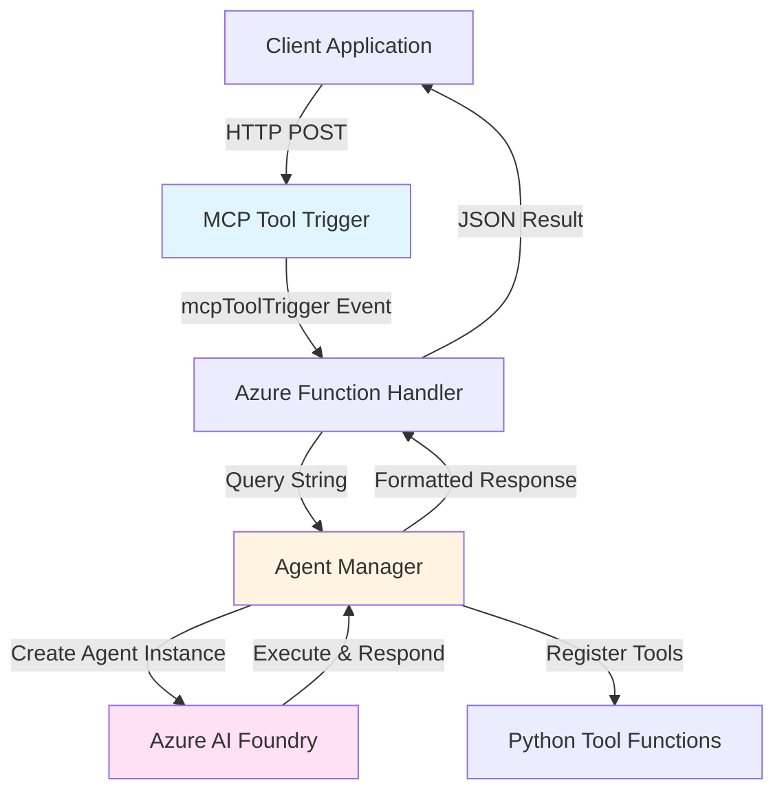
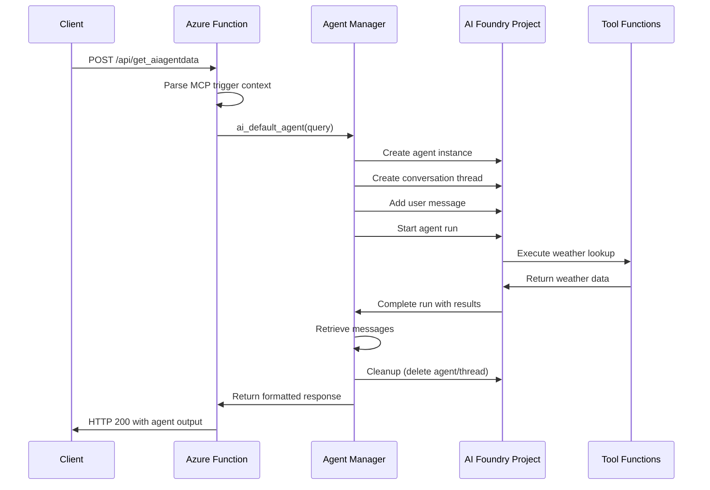
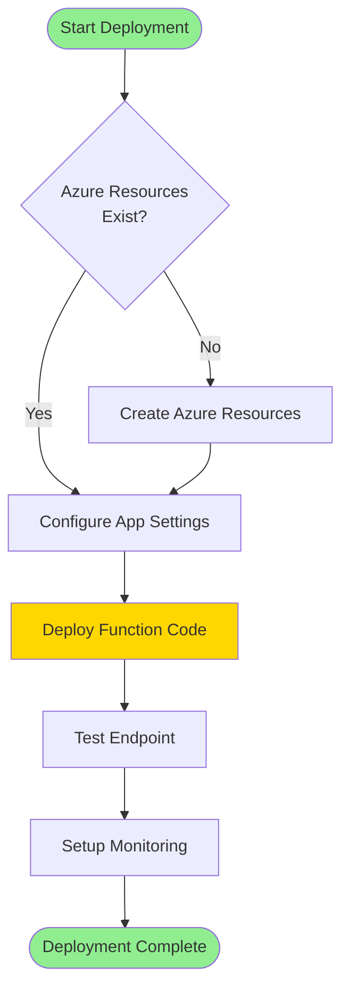
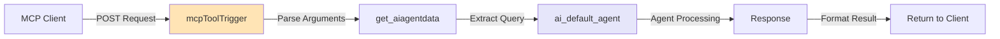
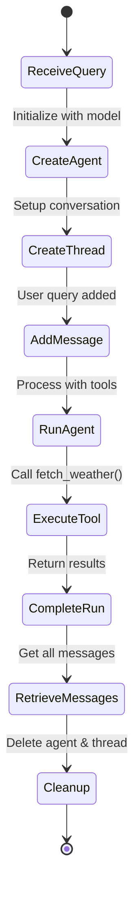

# MCP Foundry Agents REST API

**Transform Azure AI Foundry Agents into accessible MCP server endpoints**

This project bridges Azure AI Foundry's powerful agent capabilities with the Model Context Protocol (MCP), enabling seamless integration of AI agents through REST API endpoints deployed on Azure Functions.

## 📋 Table of Contents

- [Overview](#overview)
- [Architecture](#architecture)
- [System Requirements](#system-requirements)
- [Configuration Guide](#configuration-guide)
- [Installation Steps](#installation-steps)
- [Deployment Workflow](#deployment-workflow)
- [API Usage](#api-usage)
- [Project Structure](#project-structure)
- [Troubleshooting](#troubleshooting)
- [Advanced Topics](#advanced-topics)

---

## Overview

### What This Project Does

This serverless application exposes Azure AI Foundry agents through MCP-compatible REST endpoints. It enables:

- **AI Agent Invocation**: Query AI agents with custom tools via HTTP requests
- **Function Tool Integration**: Connect Python functions as agent capabilities
- **MCP Protocol Support**: Native Model Context Protocol trigger bindings
- **Serverless Execution**: Fully managed Azure Functions infrastructure

### Key Features

✅ Zero-infrastructure agent deployment  
✅ Custom tool registration for agents  
✅ Weather query example implementation  
✅ Thread-based conversation management  
✅ Automatic agent lifecycle handling  

---

## Architecture

### High-Level System Design



### Data Flow Architecture



---

## System Requirements

### Azure Resources Needed

| Resource | Purpose | Notes |
|----------|---------|-------|
| **Azure AI Foundry Project** | Host agent runtime | Must have model deployment |
| **Azure OpenAI Service** | Language model access | Requires API key |
| **Azure Functions (Consumption)** | Serverless hosting | Python 3.9+ runtime |
| **Application Insights** | Logging & monitoring | Optional but recommended |

### Local Development Tools

- **Python**: Version 3.9 or higher
- **Azure Functions Core Tools**: v4.x
- **Azure CLI**: Latest version
- **IDE**: VS Code with Azure Functions extension

### Python Dependencies

All dependencies are managed in `requirements.txt`:
- `azure-functions` - Function app framework
- `azure-ai-projects` - AI Foundry client SDK
- `azure-ai-agents` - Agent management APIs
- `azure-identity` - Authentication handling
- `python-dotenv` - Environment variable loading
- `openai` - OpenAI API client

---

## Configuration Guide

### Environment Variables Setup

Create a `.env` file in the project root with these settings:

```bash
# Azure AI Foundry Configuration
PROJECT_ENDPOINT=https://<your-account>.services.ai.azure.com/api/projects/<project-name>

# Model Deployment Settings
MODEL_ENDPOINT=https://<your-account>.services.ai.azure.com
MODEL_API_KEY=your-api-key-here
MODEL_DEPLOYMENT_NAME=gpt-4o-mini

# Azure OpenAI Direct Access (if needed)
AZURE_OPENAI_ENDPOINT=https://<your-openai>.openai.azure.com/
AZURE_OPENAI_KEY=your-openai-key-here

# Tracing Configuration
AZURE_TRACING_GEN_AI_CONTENT_RECORDING_ENABLED=true
```

### Configuration Parameters Explained

**PROJECT_ENDPOINT**: Your AI Foundry project's full API endpoint  
**MODEL_ENDPOINT**: Base URL for your AI service account  
**MODEL_API_KEY**: Authentication key for model access  
**MODEL_DEPLOYMENT_NAME**: Deployed model identifier (e.g., gpt-4o-mini, gpt-4)  
**AZURE_OPENAI_ENDPOINT**: Direct OpenAI service endpoint  
**AZURE_OPENAI_KEY**: OpenAI service access key  

### Authentication Configuration

The application uses `DefaultAzureCredential` which attempts authentication through:

1. Environment variables
2. Managed Identity (in Azure)
3. Azure CLI credentials
4. Interactive browser login

For local development, run: `az login`

---

## Installation Steps

### Step 1: Clone Repository

```bash
git clone https://github.com/Unigalactix/mcpfoundryagentsrestapi.git
cd mcpfoundryagentsrestapi
```

### Step 2: Create Virtual Environment

```bash
python -m venv venv

# Activate on Windows
venv\Scripts\activate

# Activate on Linux/Mac
source venv/bin/activate
```

### Step 3: Install Dependencies

```bash
pip install -r requirements.txt
```

### Step 4: Configure Environment

```bash
# Copy example configuration
cp .env.example .env

# Edit .env with your Azure credentials
nano .env  # or use your preferred editor
```

### Step 5: Verify Local Setup

```bash
# Start the Functions runtime locally
func start

# Expected output:
# Azure Functions Core Tools
# Http Functions:
#     get_aiagentdata: [POST] http://localhost:7071/api/get_aiagentdata
```

---

## Deployment Workflow

### Deployment Process Flowchart



### Deployment Commands

#### Option A: Deploy via Azure CLI

```bash
# Login to Azure
az login

# Create resource group (if needed)
az group create --name myResourceGroup --location eastus

# Create Function App
az functionapp create \
  --resource-group myResourceGroup \
  --consumption-plan-location eastus \
  --runtime python \
  --runtime-version 3.9 \
  --functions-version 4 \
  --name myAgentMCPFunction \
  --storage-account mystorageaccount

# Deploy code
func azure functionapp publish myAgentMCPFunction
```

#### Option B: Deploy from VS Code

1. Open project in VS Code
2. Click Azure icon in sidebar
3. Sign in to Azure account
4. Right-click Function App → "Deploy to Function App"
5. Select or create Function App
6. Confirm deployment

### Post-Deployment Configuration

Set environment variables in Azure Portal:

```bash
az functionapp config appsettings set \
  --name myAgentMCPFunction \
  --resource-group myResourceGroup \
  --settings \
    PROJECT_ENDPOINT="<your-endpoint>" \
    MODEL_API_KEY="<your-key>" \
    MODEL_DEPLOYMENT_NAME="gpt-4o-mini"
```

---

## API Usage

### MCP Tool Trigger Invocation



### Example Request

```bash
curl -X POST https://<your-function-app>.azurewebsites.net/api/get_aiagentdata \
  -H "Content-Type: application/json" \
  -d '{
    "toolName": "get_aiagentdata",
    "arguments": {
      "query": "What is the weather in Tokyo today?"
    }
  }'
```

### Example Response

```json
{
  "result": "Hello, Source: The weather in Tokyo today is Rainy, 22°C\n. This HTTP triggered function executed successfully."
}
```

### Agent Execution Flow



### Supported Tool Operations

The current implementation includes:

**get_aiagentdata**: Query AI agent with natural language
- **Input**: `query` (string) - Your question or request
- **Output**: Agent's response with tool execution results
- **Example**: "What is the weather in Seattle today?"

---

## Project Structure

```
mcpfoundryagentsrestapi/
├── .vscode/                    # VS Code configuration
│   └── settings.json          # Editor settings
├── function_app.py            # Main Azure Function definitions
├── agents.py                  # Agent management logic
├── host.json                  # Function host configuration
├── requirements.txt           # Python dependencies
├── .funcignore               # Deployment exclusions
├── .gitignore                # Git exclusions
└── README.md                 # This documentation
```

### File Descriptions

**function_app.py**  
Defines MCP tool trigger binding, handles HTTP requests, orchestrates agent calls

**agents.py**  
Contains agent creation logic, tool registration, conversation management, cleanup

**host.json**  
Configures Function runtime, extension bundles, MCP server metadata

**requirements.txt**  
Lists all Python package dependencies for the project

---

## Troubleshooting

### Common Issues & Solutions

#### Issue: "Agent creation failed"

**Symptoms**: Error when calling `create_agent`

**Solutions**:
1. Verify `MODEL_DEPLOYMENT_NAME` matches deployed model
2. Check `PROJECT_ENDPOINT` format is correct
3. Ensure model has sufficient quota
4. Validate authentication credentials

#### Issue: "DefaultAzureCredential authentication failed"

**Symptoms**: Cannot authenticate to AI Foundry

**Solutions**:
1. Run `az login` for local development
2. For Azure deployment, enable Managed Identity
3. Verify RBAC permissions on AI Foundry project
4. Check firewall rules allow Function App IP

#### Issue: "Function timeout during agent run"

**Symptoms**: HTTP 500 or timeout errors

**Solutions**:
1. Increase function timeout in host.json
2. Simplify agent instructions
3. Use faster model deployment
4. Implement async processing pattern

#### Issue: "Missing environment variables"

**Symptoms**: KeyError when accessing os.environ

**Solutions**:
1. Verify `.env` file exists locally
2. Check Azure App Settings in portal
3. Ensure all required variables are set
4. Restart Function App after config changes

### Debugging Tips

**Local Testing**:
```bash
# Enable verbose logging
export AZURE_FUNCTIONS_ENVIRONMENT=Development
func start --verbose
```

**View Logs in Azure**:
```bash
az functionapp log tail --name myAgentMCPFunction --resource-group myResourceGroup
```

**Check Function Health**:
```bash
curl https://<your-app>.azurewebsites.net/admin/host/status
```

---

## Advanced Topics

### Adding Custom Tools

To extend agent capabilities, modify `agents.py`:

```python
def calculate_sum(a: int, b: int) -> int:
    """
    Adds two numbers together.
    
    :param a: First number
    :param b: Second number
    :return: Sum of a and b
    """
    return a + b

# Register in user_functions set
user_functions = {fetch_weather, calculate_sum}
```

### Implementing Persistent Conversations

Currently, each request creates a new thread. For persistence:

1. Store `thread_id` in database or cache
2. Retrieve existing thread instead of creating new
3. Skip agent deletion for reuse
4. Implement thread expiration policy

### Scaling Considerations

**Horizontal Scaling**: Azure Functions auto-scales based on load

**Performance Optimization**:
- Cache agent instances (requires thread-safe implementation)
- Use connection pooling for AI Foundry client
- Implement response caching for repeated queries
- Consider Durable Functions for long-running operations

### Security Best Practices

✓ Store secrets in Azure Key Vault  
✓ Enable Managed Identity authentication  
✓ Restrict Function App network access  
✓ Implement rate limiting on endpoints  
✓ Validate and sanitize all input parameters  
✓ Enable Application Insights for audit trails  

---

## Contributing

Contributions are welcome! Please:

1. Fork the repository
2. Create a feature branch
3. Make your changes with clear commits
4. Add tests if applicable
5. Submit a pull request

---

## License

This project is provided as-is for educational and development purposes. Refer to repository license file for details.

---

## Support & Resources

- **Azure AI Foundry Docs**: https://learn.microsoft.com/azure/ai-studio/
- **Azure Functions Python**: https://learn.microsoft.com/azure/azure-functions/functions-reference-python
- **MCP Protocol**: https://modelcontextprotocol.io/
- **Issues**: Report bugs via GitHub Issues

---

**Made with ❤️ for the Azure AI community**
